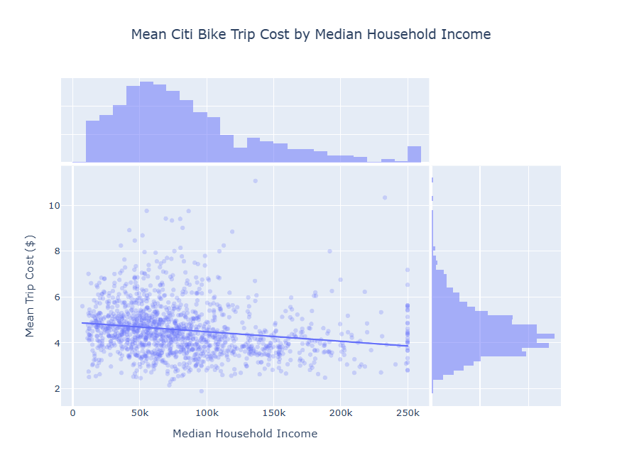
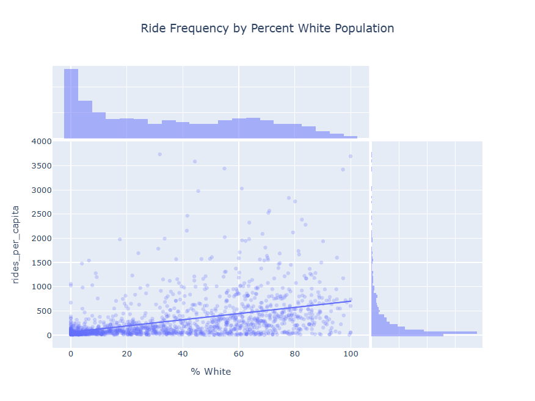

# Spatial Equity Implications of Citi Bike's Pricing Model

[](https://emmaturzillo.github.io/citibike)
[](https://www.python.org/)

**[View the Live Interactive Report Here](https://emmaturzillo.github.io/citibike)**

---

## Executive Summary

This analysis explores Citi Bike data from June 2026 in NYC to understand how income and race affect Citi Bike trip frequency, duration and cost. The findings were statistically significant, suggesting that, on the whole, higher income and whiter block groups tend to use Citi Bike with more frequency per capita while bearing lower financial and time costs. I interpret this to mean that Citi Bike's current pricing model exacerbates existing spatial inequities along racial and class lines, and that a $3 cap on Citi Bike fares, as proposed by Transportation Alternatives, would benefit all riders while disproportionately supporting riders most in need of better transportation options with which to access jobs, services, education, and social connections.

---

## Key Insights & Data-Driven Recommendation

* **Key Insight 1:** As median household income in a block group increases, ride frequency per capita increases moderately (r = 0.51). Median household income explains 26.43% of the variability in Citi Bike frequency per capita between block groups.
* **Key Insight 2:** As median household income in a block group decreases, mean Citi Bike trip cost increases slightly (r = -0.27). Median household income explains 7.46% of the variability in Citi Bike trip cost.
* **Data-Driven Recommendation:** Policymakers interested in advancing spatial equity should support Transportation Alternatives's proposed $3 cap on Citi Bike rides. This policy would increase access to jobs and services and reduce household costs for all New Yorkers, but would disproportionately support those who need it most.

---

## Key Visualizations

| Insight Highlight | Visual |
| :--- | :--- |
| **Mean Citi Bike Trip Cost by Median Household Income**
This chart illustrates the relationship between the median household income of a block group and the mean cost of a Citi Bike trip originating from that block group. Despite having more means with which to pay for all means of transportation, higher income households, on the whole, pay the least for Citi Bike trips. |  |
| **Ride Frequency by Percent White Population**
This chart illustrates the relationship between the percent population of a block group that is white and the frequency of Citi Bike trips taken. On the whole, the whitest block groups in Citi Bike's NYC service area take the most trips per capita, suggesting that the time and/or financial costs of Citi Bike trips are most bearable for households in the whitest block groups under the current pricing model. |  |

---

## Data Pipeline & Methods

* **Data Cleaning & Preprocessing:** Downloaded data from [Citi Bike's website](https://citibikenyc.com/system-data). Limited scope to June 2026 data in NYC. Cleaned station ID strings and imputed missing station IDs using station name where possible. Dropped records where station ID could not be determined, as well as records with missing start and/or end times.
* **Exploratory Data Analysis:** Evaluated distribution of Citi Bike frequency, time cost (trip duration), and financial cost at the block group level. Assessed relationship between these variables and block groups's 1) median household income, and 2) % of population that is white. Used ranked regression in all cases.
* **Modeling / Reporting:** Rendered full analytical report via Quarto to combine code execution, interactivity, and narrative text.

---

## Repository Structure

```default
├── README.md                               <- Executive summary & key visual takeaways
├── docs/                                   <- GitHub Pages site files
│   └── index.html                          <- Live Quarto HTML report
│   └── assets/                             <- Static images for README
│       └── MeanCitiBikeTripCostbyMHI.png   <- Sample chart #1
├── notebooks/                              <- Full exploratory notebooks
│   └── project_eda.ipynb                   <- Complete Python analysis script
├── data/                                   <- Raw datasets
│   └── citibike/
│       └── 2026_06/                        <- Citi Bike data downloaded from Citi Bike's website
└── requirements.txt                        <- Dependency list for local setup
```

## Requirements
- **Python:** 3.10+
- **Core Libraries:** `pandas`, `numpy`, `plotly`, `geopandas`, `matplotlib`, `seaborn`, `folium`, `statsmodels`

## Contact
- Author: Emma Turzillo
- Initial Publication Date: 2026/08/26
- LinkedIn: [linkedin.com/in/emmaturzillo/](https://www.linkedin.com/in/emmaturzillo/)